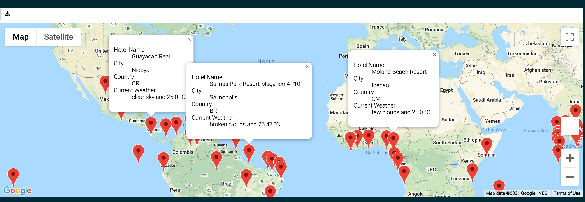
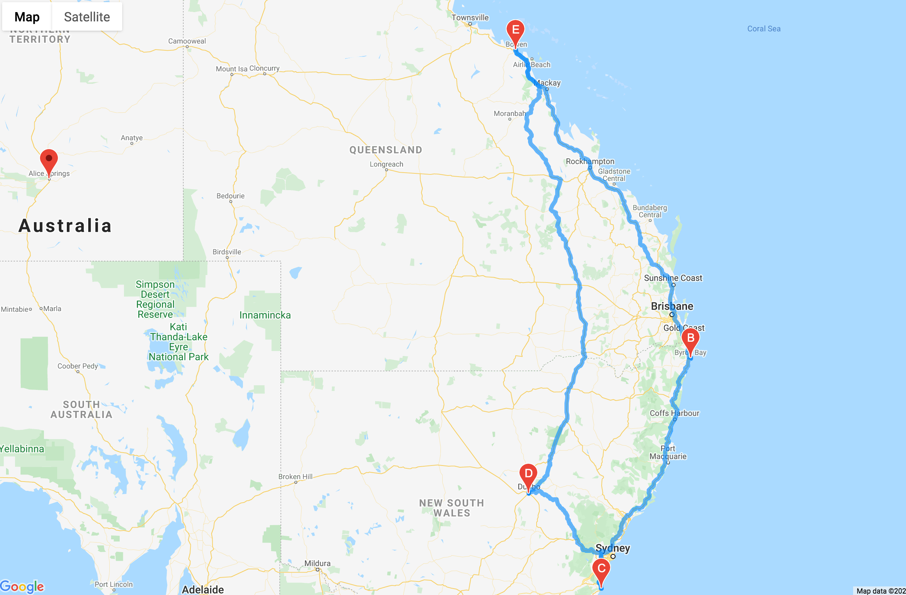
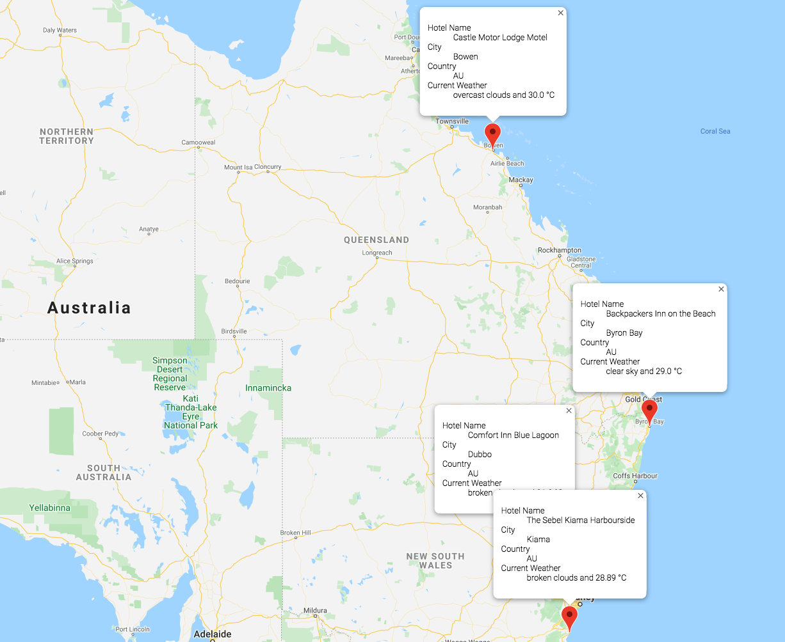

# World_Weather_Analysis
## Purpose
As Covid lock down still ongoing, it is not a time for vacation yet. BUT, it is time for planning ahead for the most desired vacation trip! The World Weather Analysis uses python with pandas, numpy, requests libraries imported, and citipy installed to look for cities with customized weather preferences for your next ideal vacation trip.

## Steps
Below are the main steps from building the database, to finding the ideal route to the trip.
* Step 1: 
        
        Retrive weather data from OpenWeatherMap with API call and create dataframe containing the weather, location information for each city across countries
* Step 2: 

        Export the dataframe created from above to a .csv file as a database
* Step 3: 

        Create a travel destinations map with user input on the weather condition preferences with google maps nearbyplaces API request and save the found nearby hotels into the dataframe
* Step 4:

        Add marker_layer and pop up marker for each city on our base map layer and display the figure
* Step 5:

        Find a desired country and create a itinerary among a few nearby cities with the desired temperature parameter defined by the user input from the above steps
* Step 6:

        Map out the itinerary on google maps by adding a directions layer
* Step 7:

        Combine the selected cities and combine them together into one dataframe and display together on a maps with pop information on the marker with hotel name, city, country, temperature information

## Results

Vacation Search by Weather Preference

---

 
Travel Map with Driving Route

---

 
Travel Map with Markers

---
